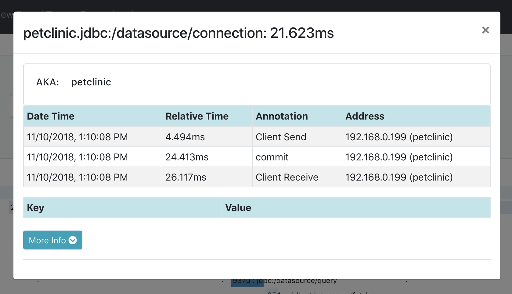
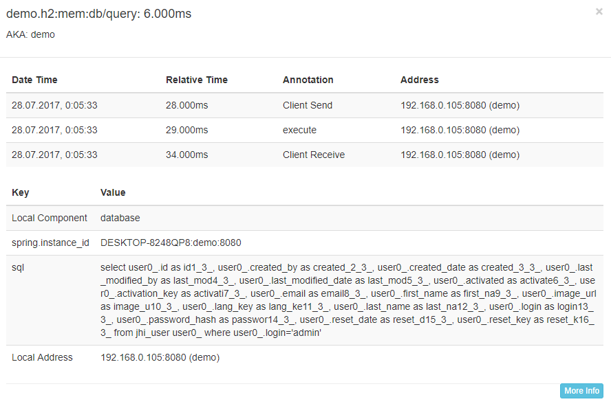
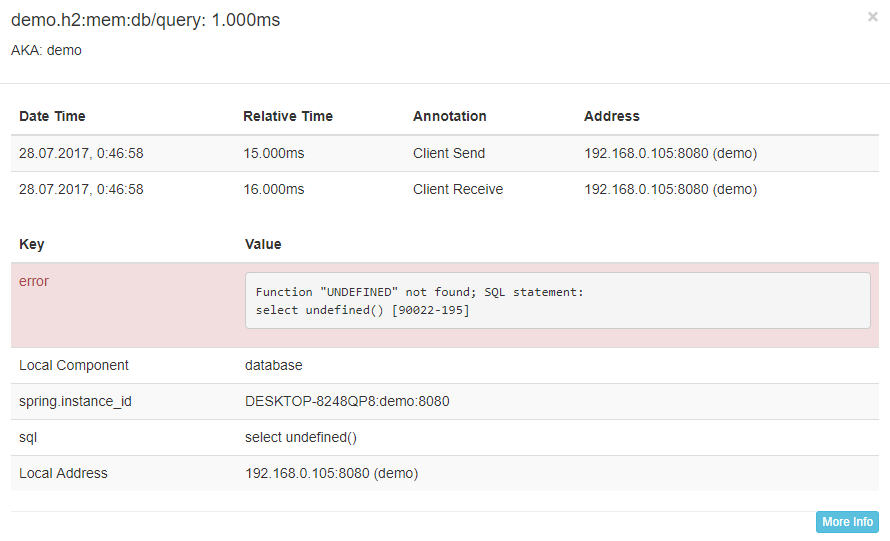

**Spring Boot DataSource Decorator**

Spring Boot autoconfiguration for integration with 
* [P6Spy](https://github.com/p6spy/p6spy)
* [Datasource Proxy](https://github.com/ttddyy/datasource-proxy)
* [FlexyPool](https://github.com/vladmihalcea/flexy-pool)

**Why Should I Care**

Of course you can just create `DataSource` bean wrapped in any proxy you want, but what will you get using this library:
* ability to configure your datasource using `spring.datasource.hikari.*`, `spring.datasource.dbcp2.*`, `spring.datasource.tomcat.*`
* `/metrics` - will display your actual datasource stats (active, usage)
* ability to disable proxying quick on appropriate environment
* configure each library using only Spring Context without pain

**Quick Start**

Add one of the starters to the classpath of a Spring Boot application and your datasources (autoconfigured or custom) will be wrapped into one of a datasource proxy providers above.

Gradle:
```groovy
compile('com.github.gavlyukovskiy:p6spy-spring-boot-starter')
compile('com.github.gavlyukovskiy:datasource-proxy-spring-boot-starter')
compile('com.github.gavlyukovskiy:flexy-pool-spring-boot-starter')
```

Maven:
```xml
<dependency>
    <groupId>com.github.gavlyukovskiy</groupId>
    <artifactId>p6spy-spring-boot-starter</artifactId>
</dependency>
<dependency>
    <groupId>com.github.gavlyukovskiy</groupId>
    <artifactId>datasource-proxy-spring-boot-starter</artifactId>
</dependency>
<dependency>
    <groupId>com.github.gavlyukovskiy</groupId>
    <artifactId>flexy-pool-spring-boot-starter</artifactId>
</dependency>
```

**P6Spy**

After adding p6spy starter you'll start getting all sql queries in the logs:
```text
2017-06-07 21:42:08.120  INFO 5456 --- [ool-1-worker-57] p6spy                                    : #1496860928120 | took 0ms | statement | connection 0|SELECT NOW()
;
2017-06-07 21:51:07.802  INFO 5456 --- [ool-1-worker-50] p6spy                                    : #1496861467802 | took 0ms | statement | connection 1|SELECT NOW()
;
2017-06-07 21:51:07.803  INFO 5456 --- [ool-1-worker-43] p6spy                                    : #1496861467803 | took 0ms | statement | connection 2|SELECT NOW()
;
2017-06-07 21:51:08.806  INFO 5456 --- [ool-1-worker-36] p6spy                                    : #1496861468806 | took 0ms | statement | connection 3|SELECT NOW()
;
```

All beans of type `JdbcEventListener` are registered in P6Spy:
```java
@Bean
public JdbcEventListener myListener() {
    return new JdbcEventListener() {
        @Override
        public void onConnectionWrapped(ConnectionInformation connectionInformation) {
            System.out.println("connection wrapped");
        }

        @Override
        public void onAfterConnectionClose(ConnectionInformation connectionInformation, SQLException e) {
            System.out.println("connection closed");
        }
    };
}
```

This done by adding `RuntimeListenerSupportFactory` into P6Spy `modulelist`, overriding this property will cause to not registering factory thus listeners will not be applied  

You can configure small set of parameters in your application properties:
```properties
# Register RuntimeListenerSupportFactory if JdbcEventListener beans were found
spring.datasource.decorator.p6spy.enable-runtime-listeners=true
# Use com.p6spy.engine.spy.appender.MultiLineFormat instead of com.p6spy.engine.spy.appender.SingleLineFormat
spring.datasource.decorator.p6spy.multiline=true
# Use logging for default listeners [slf4j, sysout, file]
spring.datasource.decorator.p6spy.logging=slf4j
# Log file to use (only with logging=file)
spring.datasource.decorator.p6spy.log-file=spy.log
```

Also you can configure P6Spy manually using one of available configuration methods. For more information please refer to the [P6Spy Configuration Guide](http://p6spy.readthedocs.io/en/latest/configandusage.html)   

**Datasource Proxy**

After adding datasource-proxy starter you'll start getting all sql queries in the logs with level `DEBUG` and slow sql queries with level `WARN`:
```text
2017-06-07 21:58:06.630  DEBUG 8492 --- [ool-1-worker-57] n.t.d.l.l.SLF4JQueryLoggingListener      : 
Name:, Time:0, Success:True
Type:Statement, Batch:False, QuerySize:1, BatchSize:0
Query:["SELECT NOW()"]
Params:[]
2017-06-07 21:58:06.630  DEBUG 8492 --- [ool-1-worker-43] n.t.d.l.l.SLF4JQueryLoggingListener      : 
Name:, Time:0, Success:True
Type:Statement, Batch:False, QuerySize:1, BatchSize:0
Query:["SELECT NOW()"]
Params:[]
2017-06-07 21:58:06.630  DEBUG 8492 --- [ool-1-worker-50] n.t.d.l.l.SLF4JQueryLoggingListener      : 
Name:, Time:0, Success:True
Type:Statement, Batch:False, QuerySize:1, BatchSize:0
Query:["SELECT NOW()"]
Params:[]
2017-06-07 22:10:50.478  WARN 8492 --- [pool-1-thread-1] n.t.d.l.logging.SLF4JSlowQueryListener   : 
Name:, Time:0, Success:False
Type:Statement, Batch:False, QuerySize:1, BatchSize:0
Query:["SELECT SLEEP(301000)"]
Params:[]
```

All beans of type `QueryExecutionListener` are registered in `ProxyDataSourceBuilder`, as well you can use Spring Context for `ParameterTransformer` and `QueryTransformer`.:
```java
@Bean
public QueryExecutionListener queryExecutionListener() {
    return new QueryExecutionListener() {
        @Override
        public void beforeQuery(ExecutionInfo execInfo, List<QueryInfo> queryInfoList) {
            System.out.println("beforeQuery");
        }

        @Override
        public void afterQuery(ExecutionInfo execInfo, List<QueryInfo> queryInfoList) {
            System.out.println("afterQuery");
        }
    };
}

@Bean
public ParameterTransformer parameterTransformer() {
    return new MyParameterTransformer();
}

@Bean
public QueryTransformer queryTransformer() {
    return new MyQueryTransformer();
}
```
You can configure logging, query/slow query listeners and more using your `application.properties`:
```properties
# One of logging libraries (slf4j, jul, common, sysout)
spring.datasource.decorator.datasource-proxy.logging=slf4j

spring.datasource.decorator.datasource-proxy.query.enable-logging=true
spring.datasource.decorator.datasource-proxy.query.log-level=debug
# Logger name to log all queries, default depends on chosen logging, e.g. net.ttddyy.dsproxy.listener.logging.SLF4JQueryLoggingListener
spring.datasource.decorator.datasource-proxy.query.logger-name=

spring.datasource.decorator.datasource-proxy.slow-query.enable-logging=true
spring.datasource.decorator.datasource-proxy.slow-query.log-level=warn
spring.datasource.decorator.datasource-proxy.slow-query.logger-name=
# Number of seconds to consider query as slow and log it
spring.datasource.decorator.datasource-proxy.slow-query.threshold=300

spring.datasource.decorator.datasource-proxy.multiline=true
spring.datasource.decorator.datasource-proxy.json-format=false
# Enable Query Metrics
spring.datasource.decorator.datasource-proxy.count-query=false
```

**Flexy Pool**

If the `flexy-pool-spring-boot-starter` is added to the classpath your datasource will be wrapped to the `FlexyPoolDataSource`.
With default setting you will start getting messages about acquiring and leasing connections:
```text
2017-07-13 01:31:02.575  INFO 5432 --- [ool-1-worker-50] c.v.flexypool.FlexyPoolDataSource        : Connection leased for 1500 millis, while threshold is set to 1000 in dataSource FlexyPoolDataSource
2017-07-13 01:31:03.143  WARN 5432 --- [ool-1-worker-51] PoolOnTimeoutConnectionAcquiringStrategy : Connection was acquired in 1502 millis, timeoutMillis is set to 500
2017-07-13 01:31:03.143  INFO 5432 --- [ool-1-worker-51] PoolOnTimeoutConnectionAcquiringStrategy : Pool size changed from previous value 10 to 11
```
You can declare bean `MetricsFactory` and besides of JMX metrics will be exported to the metrics provider and to the logs:
```text
2017-07-13 02:07:04.265  INFO 5432 --- [rter-1-thread-1] c.v.f.metric.codahale.CodahaleMetrics    : type=HISTOGRAM, name=concurrentConnectionRequestsHistogram, count=4, min=0, max=1, mean=0.5, stddev=0.5, median=1.0, p75=1.0, p95=1.0, p98=1.0, p99=1.0, p999=1.0
2017-07-13 02:07:04.265  INFO 5432 --- [rter-1-thread-1] c.v.f.metric.codahale.CodahaleMetrics    : type=HISTOGRAM, name=concurrentConnectionsHistogram, count=4, min=0, max=1, mean=0.5, stddev=0.5, median=1.0, p75=1.0, p95=1.0, p98=1.0, p99=1.0, p999=1.0
2017-07-13 02:07:04.265  INFO 5432 --- [rter-1-thread-1] c.v.f.metric.codahale.CodahaleMetrics    : type=HISTOGRAM, name=maxPoolSizeHistogram, count=1, min=10, max=10, mean=10.0, stddev=0.0, median=10.0, p75=10.0, p95=10.0, p98=10.0, p99=10.0, p999=10.0
2017-07-13 02:07:04.265  INFO 5432 --- [rter-1-thread-1] c.v.f.metric.codahale.CodahaleMetrics    : type=HISTOGRAM, name=overflowPoolSizeHistogram, count=0, min=0, max=0, mean=0.0, stddev=0.0, median=0.0, p75=0.0, p95=0.0, p98=0.0, p99=0.0, p999=0.0
2017-07-13 02:07:04.265  INFO 5432 --- [rter-1-thread-1] c.v.f.metric.codahale.CodahaleMetrics    : type=HISTOGRAM, name=retryAttemptsHistogram, count=0, min=0, max=0, mean=0.0, stddev=0.0, median=0.0, p75=0.0, p95=0.0, p98=0.0, p99=0.0, p999=0.0
2017-07-13 02:07:04.265  INFO 5432 --- [rter-1-thread-1] c.v.f.metric.codahale.CodahaleMetrics    : type=TIMER, name=connectionAcquireMillis, count=2, min=0.0, max=39.0, mean=19.5, stddev=19.5, median=39.0, p75=39.0, p95=39.0, p98=39.0, p99=39.0, p999=39.0, mean_rate=0.07135042014375073, m1=0.02490778899904623, m5=0.006288975787638508, m15=0.002179432534806779, rate_unit=events/second, duration_unit=milliseconds
2017-07-13 02:07:04.265  INFO 5432 --- [rter-1-thread-1] c.v.f.metric.codahale.CodahaleMetrics    : type=TIMER, name=connectionLeaseMillis, count=2, min=3.0, max=7.0, mean=5.0, stddev=2.0, median=7.0, p75=7.0, p95=7.0, p98=7.0, p99=7.0, p999=7.0, mean_rate=0.07135743555785098, m1=0.02490778899904623, m5=0.006288975787638508, m15=0.002179432534806779, rate_unit=events/second, duration_unit=milliseconds
2017-07-13 02:07:04.265  INFO 5432 --- [rter-1-thread-1] c.v.f.metric.codahale.CodahaleMetrics    : type=TIMER, name=overallConnectionAcquireMillis, count=2, min=0.0, max=39.0, mean=19.5, stddev=19.5, median=39.0, p75=39.0, p95=39.0, p98=39.0, p99=39.0, p999=39.0, mean_rate=0.07135462550886962, m1=0.02490778899904623, m5=0.006288975787638508, m15=0.002179432534806779, rate_unit=events/second, duration_unit=milliseconds
```

All beans of type `ConnectionAcquiringStrategyFactory` are used to provide `ConnectionAcquiringStrategy` for the pool. 

`MetricsFactory` and `ConnectionProxyFactory` beans can be used to customize metrics and connection decorators. 

`EventListener<? extends Event>` beans can be registered to subscribe on events of flexy-pool (e.g. `ConnectionAcquireTimeThresholdExceededEvent`, `ConnectionLeaseTimeThresholdExceededEvent`). 

You can configure your `FlexyPoolDataSource` by using bean `FlexyPoolConfigurationBuilderCustomizer` or properties:
```properties
# Increments pool size if connection acquire request has timed out
spring.datasource.decorator.flexy-pool.acquiring-strategy.increment-pool.max-overflow-pool-size=15
spring.datasource.decorator.flexy-pool.acquiring-strategy.increment-pool.timeout-millis=500

# Retries on getting connection
spring.datasource.decorator.flexy-pool.acquiring-strategy.retry.attempts=2

# Enable metrics exporting to the JMX
spring.datasource.decorator.flexy-pool.metrics.reporter.jmx.enabled=true
spring.datasource.decorator.flexy-pool.metrics.reporter.jmx.auto-start=false

# Millis between two consecutive log reports
spring.datasource.decorator.flexy-pool.metrics.reporter.log.millis=300000

# Enable logging and publishing ConnectionAcquireTimeThresholdExceededEvent when a connection acquire request has timed out
spring.datasource.decorator.flexy-pool.threshold.connection.acquire=50
# Enable logging and publishing ConnectionLeaseTimeThresholdExceededEvent when a connection lease has exceeded the given time threshold
spring.datasource.decorator.flexy-pool.threshold.connection.lease=1000
```

**Spring Cloud Sleuth**

With P6Spy span will be created for:
 * `<db_host>/connection` - opening connection including events for commits and rollbacks 
 * `<db_host>/query` - executing query including sql text in the tags, if the query returns `ResultSet` time between execution and closing is included in the span

With Datasource Proxy span will be created for:
 * executing query including sql text (without parameters) in the tags.


Example request:


Details of connection span:


Details of query span:




**Custom Decorators**

Custom data source decorators are supported through declaring beans of type `DataSourceDecorator`
```java
@Bean
public DataSourceDecorator customDecorator() {
  return (beanName, dataSource) -> new DataSourceWrapper(dataSource);
}
```

**Disable Decorating**

If you want to disable decorating set `spring.datasource.decorator.excludeBeans` with bean names you want to exclude or set `spring.datasource.decorator.enabled` to `false` if you want to disable all decorators for all datasources.
